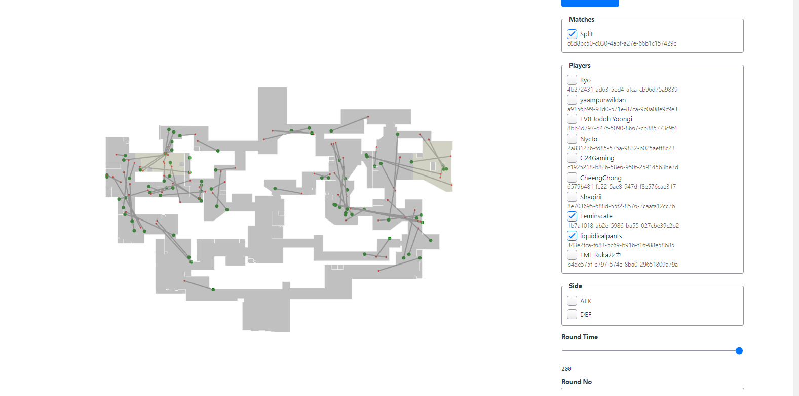

Example match id: c8d8bc50-c030-4abf-a27e-66b1c157429c

# Valorant Heatmap (Frontend Repo)




## Project setup
```
npm install
```

### Compiles and hot-reloads for development
```
npm run serve
```

### Compiles and minifies for production
```
npm run build
```

### Customize configuration
See [Configuration Reference](https://cli.vuejs.org/config/).
